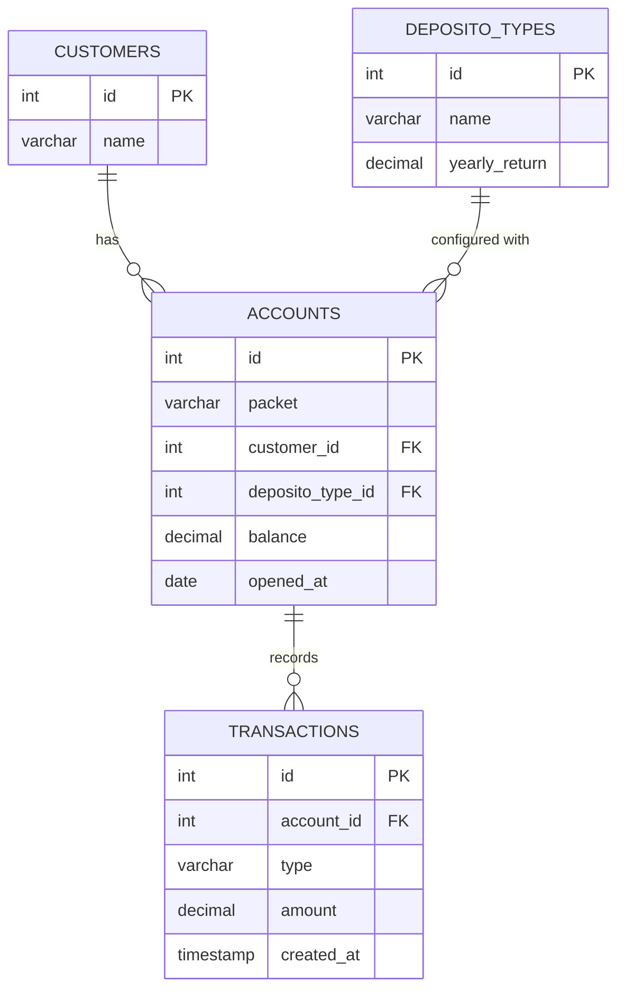

# Database Design - Bank Saving System

## Overview

This document describes the database schema for the Bank Saving System, a deposito account management application.

## Entity Relationship Diagram (ERD)



## Table Specifications

### 1. customers

Stores customer information.

| Column | Type | Constraints | Description |
|--------|------|-------------|-------------|
| id | SERIAL | PRIMARY KEY | Auto-incrementing customer ID |
| name | VARCHAR(255) | NOT NULL | Customer full name |

**Indexes:**
- PRIMARY KEY on `id`

**Sample Data:**
```sql
INSERT INTO customers (name) VALUES 
('John Doe'),
('Jane Smith'),
('Bob Johnson');
```

---

### 2. deposito_types

Defines different deposito packages with their interest rates.

| Column | Type | Constraints | Description |
|--------|------|-------------|-------------|
| id | SERIAL | PRIMARY KEY | Auto-incrementing type ID |
| name | VARCHAR(100) | NOT NULL | Package name (e.g., Bronze, Silver, Gold) |
| yearly_return | DECIMAL(5,2) | NOT NULL | Annual interest rate percentage (e.g., 3.00 for 3%) |

**Indexes:**
- PRIMARY KEY on `id`

**Business Rules:**
- `yearly_return` typically ranges from 1% to 10%
- Monthly return is calculated as `yearly_return / 12`

**Sample Data:**
```sql
INSERT INTO deposito_types (name, yearly_return) VALUES 
('Bronze', 3.00),
('Silver', 5.00),
('Gold', 7.50);
```

---

### 3. accounts

Represents customer deposito accounts.

| Column | Type | Constraints | Description |
|--------|------|-------------|-------------|
| id | SERIAL | PRIMARY KEY | Auto-incrementing account ID |
| packet | VARCHAR(100) | NOT NULL | Package variant (e.g., Regular, Premium) |
| customer_id | INTEGER | NOT NULL, FK → customers(id) | Owner of the account |
| deposito_type_id | INTEGER | NOT NULL, FK → deposito_types(id) | Associated deposito package |
| balance | DECIMAL(15,2) | NOT NULL, DEFAULT 0 | Current account balance |
| opened_at | DATE | NOT NULL, DEFAULT CURRENT_DATE | Account opening date |

**Indexes:**
- PRIMARY KEY on `id`
- INDEX on `customer_id`
- INDEX on `deposito_type_id`

**Foreign Keys:**
- `customer_id` REFERENCES `customers(id)` ON DELETE CASCADE
- `deposito_type_id` REFERENCES `deposito_types(id)` ON DELETE RESTRICT

**Business Rules:**
- Balance cannot be negative
- One customer can have multiple accounts
- Opened date cannot be in the future

**Sample Data:**
```sql
INSERT INTO accounts (packet, customer_id, deposito_type_id, balance, opened_at) VALUES 
('Regular', 1, 1, 10000000, '2024-01-01'),
('Premium', 1, 2, 50000000, '2024-02-15'),
('Regular', 2, 3, 25000000, '2024-03-10');
```

---

### 4. transactions

Records all deposit and withdrawal operations.

| Column | Type | Constraints | Description |
|--------|------|-------------|-------------|
| id | SERIAL | PRIMARY KEY | Auto-incrementing transaction ID |
| account_id | INTEGER | NOT NULL, FK → accounts(id) | Account performing the transaction |
| type | VARCHAR(20) | NOT NULL, CHECK IN ('DEPOSIT', 'WITHDRAW') | Transaction type |
| amount | DECIMAL(15,2) | NOT NULL, CHECK > 0 | Transaction amount |
| created_at | TIMESTAMP | NOT NULL, DEFAULT NOW() | Transaction timestamp |

**Indexes:**
- PRIMARY KEY on `id`
- INDEX on `account_id`
- INDEX on `created_at`

**Foreign Keys:**
- `account_id` REFERENCES `accounts(id)` ON DELETE CASCADE

**Business Rules:**
- Amount must be positive
- Type must be either 'DEPOSIT' or 'WITHDRAW'
- Created timestamp is automatically set

**Sample Data:**
```sql
INSERT INTO transactions (account_id, type, amount, created_at) VALUES 
(1, 'DEPOSIT', 5000000, '2024-01-15 10:30:00'),
(1, 'DEPOSIT', 3000000, '2024-02-20 14:45:00'),
(2, 'WITHDRAW', 55750000, '2024-06-01 09:00:00');
```

---

## Database Relationships

### One-to-Many Relationships

1. **customers (1) → accounts (N)**
   - One customer can have multiple accounts
   - Deleting a customer cascades to delete all their accounts

2. **deposito_types (1) → accounts (N)**
   - One deposito type can be used by multiple accounts
   - Cannot delete a deposito type if accounts are using it (RESTRICT)

3. **accounts (1) → transactions (N)**
   - One account can have multiple transactions
   - Deleting an account cascades to delete all its transactions

## Interest Calculation Logic

The system calculates interest on withdrawal using the following formula:

```
months = number of months between opened_at and withdrawal_date
monthly_return = yearly_return / 12 / 100
interest = balance × months × monthly_return
ending_balance = balance + interest
```

**Example:**
- Balance: Rp 10,000,000
- Yearly return: 6%
- Duration: 12 months

```
monthly_return = 6 / 12 / 100 = 0.005 (0.5%)
interest = 10,000,000 × 12 × 0.005 = 600,000
ending_balance = 10,000,000 + 600,000 = 10,600,000
```

## Database Setup Script

```sql
-- Create tables in order (respecting dependencies)

CREATE TABLE customers (
    id SERIAL PRIMARY KEY,
    name VARCHAR(255) NOT NULL
);

CREATE TABLE deposito_types (
    id SERIAL PRIMARY KEY,
    name VARCHAR(100) NOT NULL,
    yearly_return DECIMAL(5,2) NOT NULL CHECK (yearly_return > 0)
);

CREATE TABLE accounts (
    id SERIAL PRIMARY KEY,
    packet VARCHAR(100) NOT NULL,
    customer_id INTEGER NOT NULL REFERENCES customers(id) ON DELETE CASCADE,
    deposito_type_id INTEGER NOT NULL REFERENCES deposito_types(id) ON DELETE RESTRICT,
    balance DECIMAL(15,2) NOT NULL DEFAULT 0 CHECK (balance >= 0),
    opened_at DATE NOT NULL DEFAULT CURRENT_DATE
);

CREATE TABLE transactions (
    id SERIAL PRIMARY KEY,
    account_id INTEGER NOT NULL REFERENCES accounts(id) ON DELETE CASCADE,
    type VARCHAR(20) NOT NULL CHECK (type IN ('DEPOSIT', 'WITHDRAW')),
    amount DECIMAL(15,2) NOT NULL CHECK (amount > 0),
    created_at TIMESTAMP NOT NULL DEFAULT NOW()
);

-- Create indexes for performance
CREATE INDEX idx_accounts_customer ON accounts(customer_id);
CREATE INDEX idx_accounts_type ON accounts(deposito_type_id);
CREATE INDEX idx_transactions_account ON transactions(account_id);
CREATE INDEX idx_transactions_created ON transactions(created_at);
```

## Constraints Summary

| Table | Constraint Type | Description |
|-------|-----------------|-------------|
| customers | PRIMARY KEY | id must be unique |
| deposito_types | PRIMARY KEY | id must be unique |
| deposito_types | CHECK | yearly_return > 0 |
| accounts | PRIMARY KEY | id must be unique |
| accounts | FOREIGN KEY | customer_id → customers(id) |
| accounts | FOREIGN KEY | deposito_type_id → deposito_types(id) |
| accounts | CHECK | balance >= 0 |
| transactions | PRIMARY KEY | id must be unique |
| transactions | FOREIGN KEY | account_id → accounts(id) |
| transactions | CHECK | type IN ('DEPOSIT', 'WITHDRAW') |
| transactions | CHECK | amount > 0 |

## Query Examples

### Get all accounts with customer and deposito type info
```sql
SELECT 
    a.id,
    a.packet,
    c.name AS customer_name,
    dt.name AS deposito_name,
    dt.yearly_return,
    a.balance,
    a.opened_at
FROM accounts a
JOIN customers c ON a.customer_id = c.id
JOIN deposito_types dt ON a.deposito_type_id = dt.id
ORDER BY a.id;
```

### Get total balance per customer
```sql
SELECT 
    c.name,
    COUNT(a.id) AS account_count,
    SUM(a.balance) AS total_balance
FROM customers c
LEFT JOIN accounts a ON c.id = a.customer_id
GROUP BY c.id, c.name
ORDER BY total_balance DESC;
```

### Get transaction history for an account
```sql
SELECT 
    t.id,
    t.type,
    t.amount,
    t.created_at
FROM transactions t
WHERE t.account_id = 1
ORDER BY t.created_at DESC;
```
