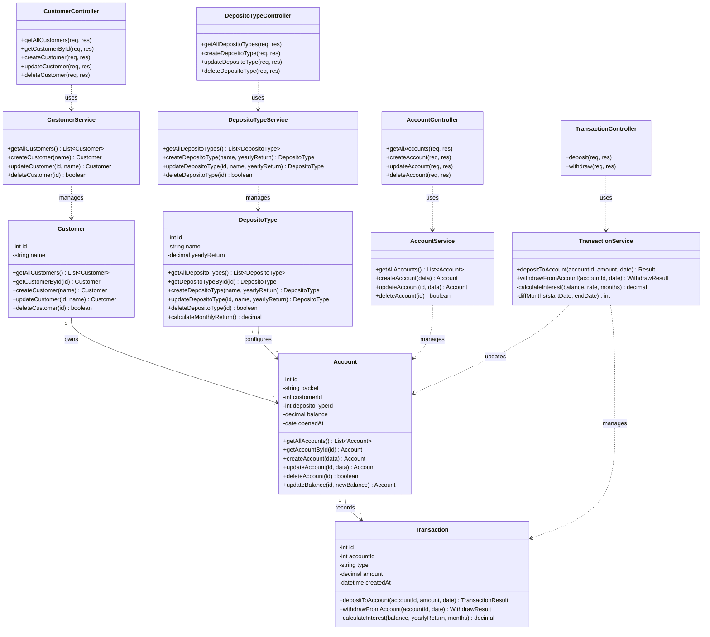
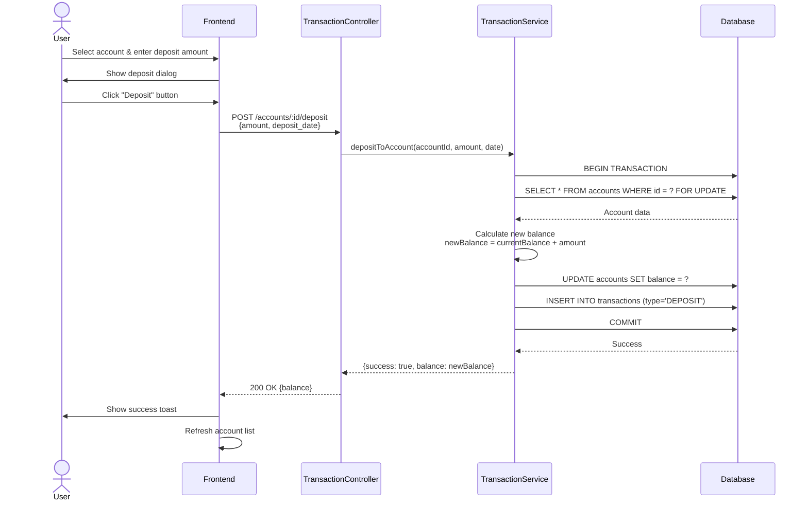
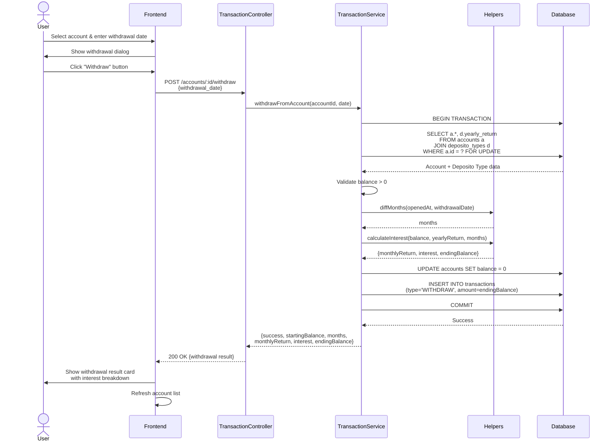
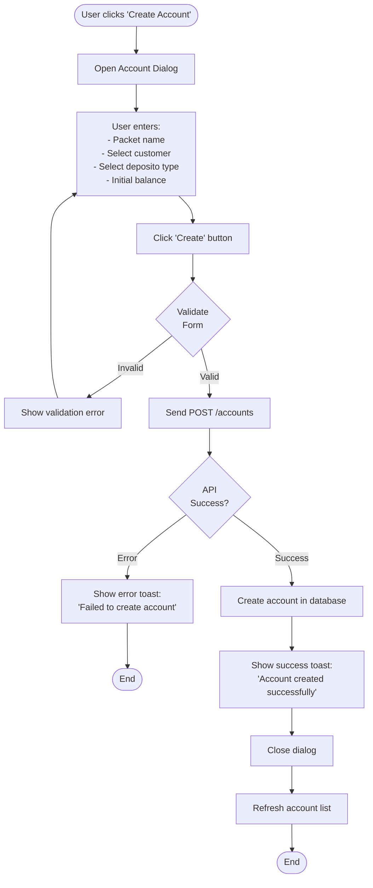
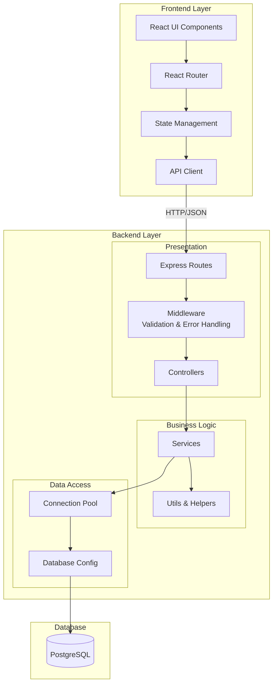
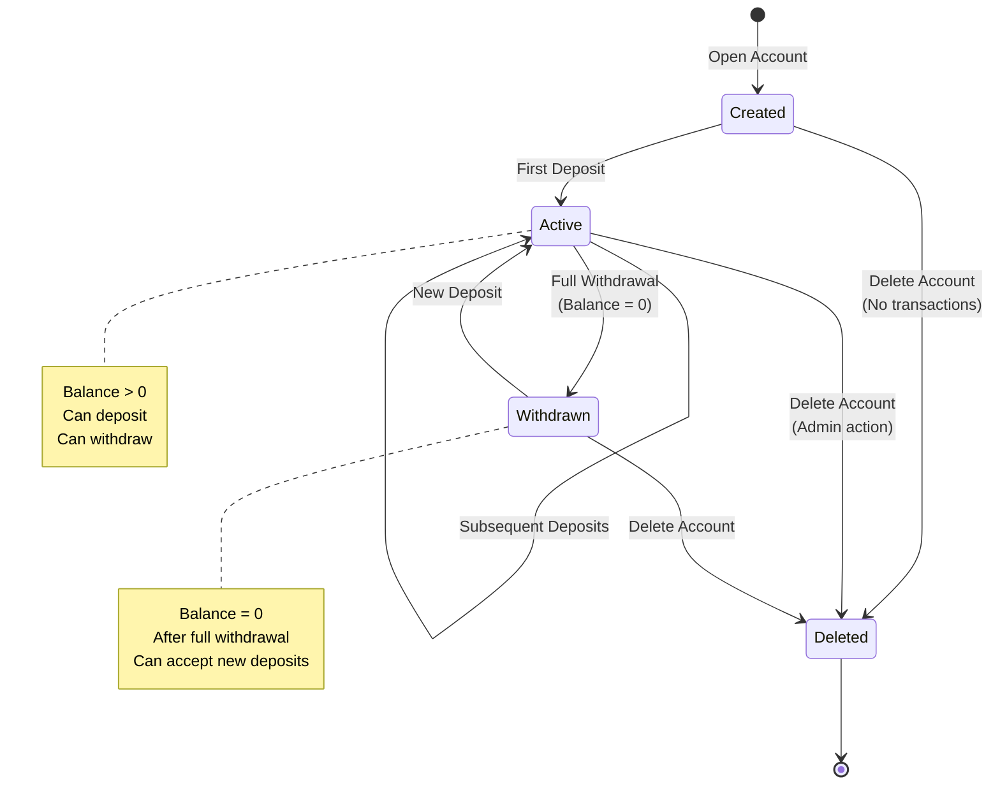
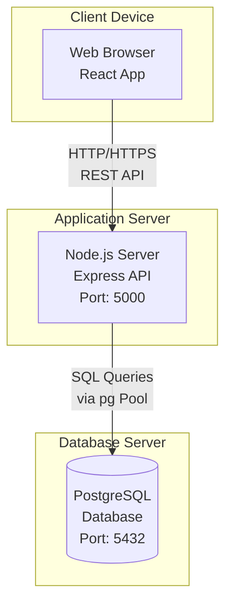
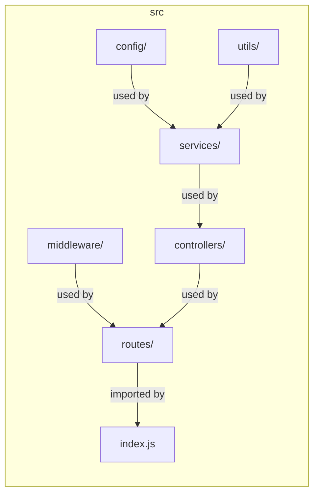

# UML Diagrams - Bank Saving System

## Class Diagram



---

## Use Case Diagram

```mermaid
graph TB
    subgraph "Bank Saving System"
        UC1[Manage Customers]
        UC2[Manage Deposito Types]
        UC3[Manage Accounts]
        UC4[Make Deposit]
        UC5[Make Withdrawal]
        UC6[View Dashboard]
        UC7[View Account Details]
        UC8[Calculate Interest]
    end

    Actor[Bank Employee/Admin]

    Actor --> UC1
    Actor --> UC2
    Actor --> UC3
    Actor --> UC4
    Actor --> UC5
    Actor --> UC6
    Actor --> UC7

    UC5 ..> UC8 : includes
    UC7 ..> UC8 : includes

    UC1 -.-> |Create| UC1A[Add Customer]
    UC1 -.-> |Read| UC1B[View Customers]
    UC1 -.-> |Update| UC1C[Edit Customer]
    UC1 -.-> |Delete| UC1D[Delete Customer]

    UC2 -.-> |Create| UC2A[Add Deposito Type]
    UC2 -.-> |Read| UC2B[View Types]
    UC2 -.-> |Update| UC2C[Edit Type]
    UC2 -.-> |Delete| UC2D[Delete Type]

    UC3 -.-> |Create| UC3A[Open Account]
    UC3 -.-> |Read| UC3B[View Accounts]
    UC3 -.-> |Update| UC3C[Edit Account]
    UC3 -.-> |Delete| UC3D[Close Account]
```

---

## Sequence Diagram: Deposit Flow



---

## Sequence Diagram: Withdrawal with Interest Calculation



---

## Activity Diagram: Account Creation Flow



---

## Component Diagram: System Architecture



---

## State Diagram: Account Lifecycle



---

## Deployment Diagram



---

## Package Diagram: Backend Structure



---

## Use Case Descriptions

### UC1: Manage Customers
**Actor:** Bank Employee/Admin
**Description:** Create, view, update, and delete customer records
**Precondition:** User has access to the system
**Postcondition:** Customer data is updated in the system

**Main Flow:**
1. User navigates to Customers page
2. System displays list of all customers
3. User can:
   - Create new customer with name
   - Edit existing customer name
   - Delete customer (if no associated accounts)

---

### UC3: Manage Accounts
**Actor:** Bank Employee/Admin
**Description:** Open, view, and close customer deposito accounts
**Precondition:** At least one customer and deposito type exist
**Postcondition:** Account is created/updated/deleted

**Main Flow:**
1. User navigates to Accounts page
2. System displays all accounts with customer and type info
3. User clicks "Create Account"
4. System shows form with:
   - Packet name field
   - Customer dropdown (from existing customers)
   - Deposito type dropdown (from existing types)
   - Optional initial balance
5. User fills form and submits
6. System validates and creates account
7. Account appears in the list

---

### UC5: Make Withdrawal
**Actor:** Bank Employee/Admin
**Description:** Withdraw all balance plus accumulated interest
**Precondition:** Account has balance > 0
**Postcondition:** Account balance becomes 0, customer receives ending balance

**Main Flow:**
1. User navigates to Transactions page
2. User selects account from dropdown
3. System shows account details (balance, opened date, rate)
4. User clicks "Make Withdrawal"
5. System shows withdrawal dialog
6. User enters withdrawal date
7. User clicks "Withdraw"
8. System calculates:
   - Duration in months
   - Monthly return rate
   - Interest earned
   - Total payout (balance + interest)
9. System sets account balance to 0
10. System records withdrawal transaction
11. System shows detailed result with breakdown

**Alternative Flow:**
- If balance is 0: Show error "Account balance is zero"
- If withdrawal date is before opened date: Show error

---

### UC8: Calculate Interest
**Actor:** System
**Description:** Calculate interest for withdrawal operations
**Precondition:** Account has balance and opened date
**Postcondition:** Interest amount is calculated

**Formula:**
```
months = number of months between opened_at and withdrawal_date
monthly_return = yearly_return / 12 / 100
interest = balance × months × monthly_return
ending_balance = balance + interest
```
