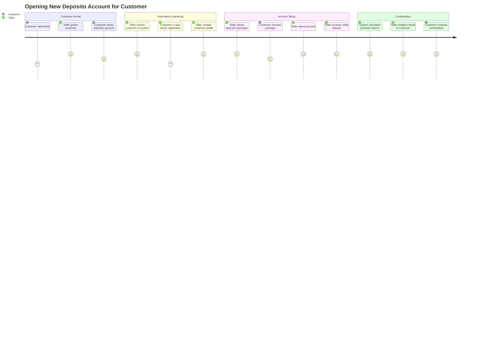
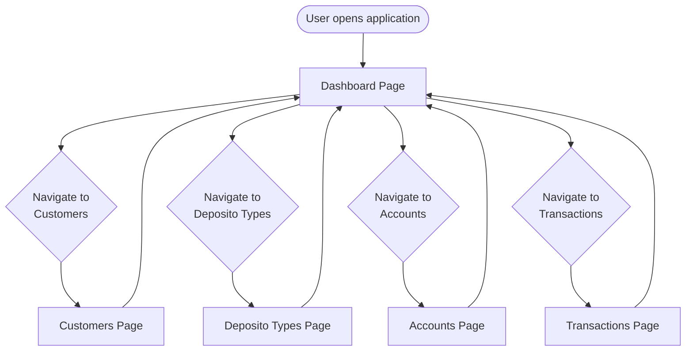
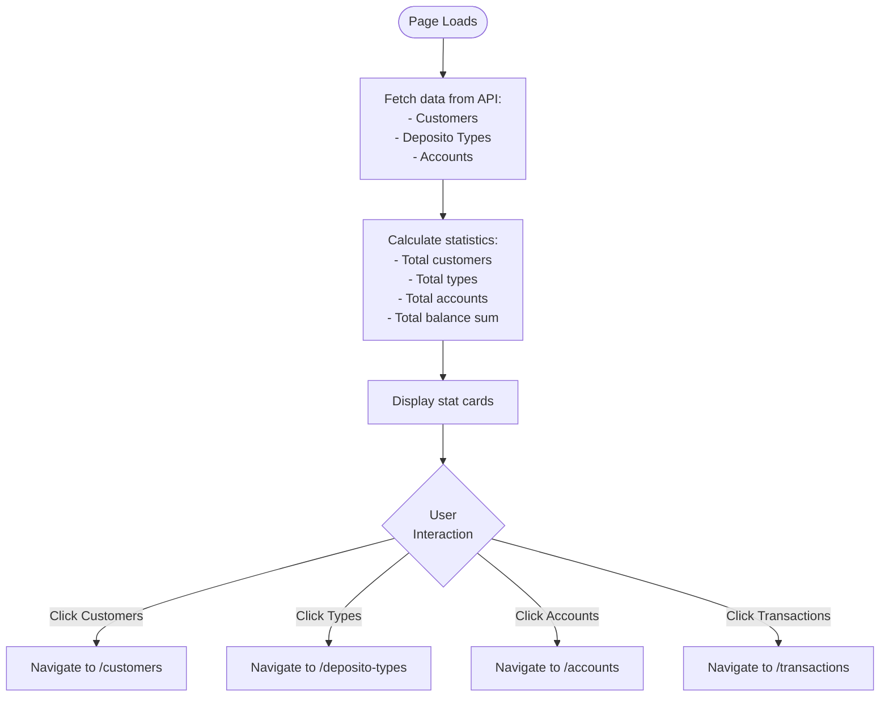
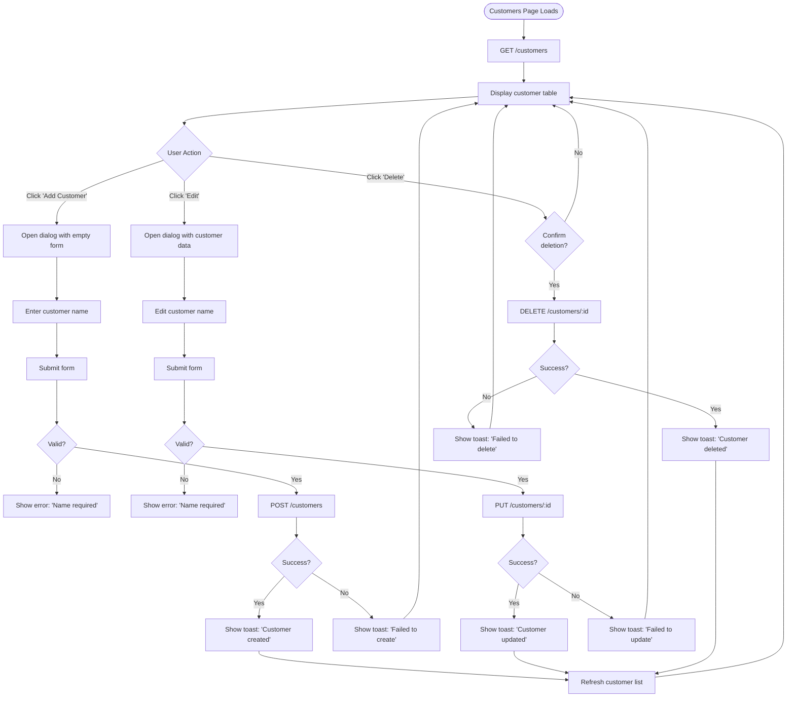

# User Journey & Flow - Bank Saving System

## User Personas

### Primary User: Bank Teller/Employee
**Name:** Sarah
**Role:** Bank Teller
**Goals:**
- Quickly process customer deposits and withdrawals
- Open new deposito accounts for customers
- Check account balances and calculate maturity amounts
**Pain Points:**
- Manual interest calculations are error-prone
- Need to switch between multiple systems
- Difficult to track account history

---

## User Journey Map

### Journey: Opening a New Deposito Account



---

## Application Flow Diagrams

### Overall Navigation Flow



---

### Dashboard Page Flow



---

### Customer Management Flow



---

### Account Creation Flow

```mermaid
flowchart TD
    Start([Accounts Page]) --> Load[Fetch data:<br/>- GET /accounts<br/>- GET /customers<br/>- GET /deposito-types]
    
    Load --> Display[Display accounts table<br/>and sidebar navigation]
    
    Display --> ClickCreate[User clicks<br/>'Create Account']
    
    ClickCreate --> ShowDialog[Show dialog with form:<br/>- Packet name<br/>- Customer dropdown<br/>- Type dropdown<br/>- Initial balance]
    
    ShowDialog --> FillForm[User fills form]
    
    FillForm --> Submit[User clicks 'Create']
    
    Submit --> Validate{All required<br/>fields filled?}
    
    Validate -->|No| ValidationError[Show error:<br/>'Please select customer and type']
    ValidationError --> FillForm
    
    Validate -->|Yes| SendAPI[POST /accounts<br/>{packet, customer_id,<br/>deposito_type_id, balance}]
    
    SendAPI --> APIResponse{API<br/>Success?}
    
    APIResponse -->|Error| ShowError[Show toast:<br/>'Failed to create account']
    APIResponse -->|Success| ShowSuccess[Show toast:<br/>'Account created successfully']
    
    ShowError --> Display
    ShowSuccess --> CloseDialog[Close dialog]
    CloseDialog --> RefreshList[Refresh account list:<br/>GET /accounts]
    RefreshList --> UpdateDisplay[Update table with<br/>new account]
    UpdateDisplay --> Display
```

---

### Deposit Transaction Flow

```mermaid
flowchart TD
    Start([Transactions Page]) --> LoadAccounts[GET /accounts]
    LoadAccounts --> ShowDropdown[Show account selection dropdown]
    
    ShowDropdown --> SelectAccount[User selects account]
    SelectAccount --> ShowDetails[Display account details:<br/>- Customer name<br/>- Packet<br/>- Deposito type<br/>- Current balance<br/>- Opened date]
    
    ShowDetails --> ClickDeposit[User clicks<br/>'Make Deposit']
    ClickDeposit --> OpenDialog[Show deposit dialog]
    
    OpenDialog --> EnterAmount[User enters:<br/>- Amount<br/>- Deposit date (optional)]
    EnterAmount --> SubmitDeposit[Click 'Deposit']
    
    SubmitDeposit --> ValidateAmount{Amount > 0?}
    ValidateAmount -->|No| ErrorAmount[Show error:<br/>'Amount must be positive']
    ErrorAmount --> EnterAmount
    
    ValidateAmount -->|Yes| APIDeposit[POST /accounts/:id/deposit<br/>{amount, deposit_date}]
    
    APIDeposit --> DepositResponse{Success?}
    
    DepositResponse -->|Error| ErrorDeposit[Show toast:<br/>'Deposit failed']
    DepositResponse -->|Success| SuccessDeposit[Show toast:<br/>'Deposit successful']
    
    SuccessDeposit --> CloseDepositDialog[Close dialog]
    CloseDepositDialog --> RefreshAccounts[Refresh account list]
    RefreshAccounts --> UpdateBalance[Update displayed balance]
    UpdateBalance --> ShowDetails
    
    ErrorDeposit --> ShowDetails
```

---

### Withdrawal with Interest Calculation Flow

```mermaid
flowchart TD
    Start([Transactions Page]) --> SelectAccount[User selects account<br/>from dropdown]
    
    SelectAccount --> ShowAccountInfo[Display account info:<br/>- Balance<br/>- Deposito type<br/>- Yearly return<br/>- Opened date]
    
    ShowAccountInfo --> ClickWithdraw[User clicks<br/>'Make Withdrawal']
    
    ClickWithdraw --> OpenWithdrawDialog[Show withdrawal dialog]
    
    OpenWithdrawDialog --> EnterDate[User enters<br/>withdrawal date]
    
    EnterDate --> SubmitWithdraw[Click 'Withdraw']
    
    SubmitWithdraw --> ValidateDate{Date<br/>provided?}
    
    ValidateDate -->|No| ErrorDate[Show error:<br/>'Withdrawal date required']
    ErrorDate --> EnterDate
    
    ValidateDate -->|Yes| APIWithdraw[POST /accounts/:id/withdraw<br/>{withdrawal_date}]
    
    APIWithdraw --> Processing[Backend calculates:<br/>1. Months between opened_at and withdrawal_date<br/>2. Monthly return rate<br/>3. Interest earned<br/>4. Ending balance]
    
    Processing --> WithdrawResponse{Success?}
    
    WithdrawResponse -->|Error:<br/>Balance = 0| ErrorZeroBalance[Show error:<br/>'Account balance is zero']
    WithdrawResponse -->|Error:<br/>Other| ErrorWithdraw[Show toast:<br/>'Withdrawal failed']
    WithdrawResponse -->|Success| SuccessWithdraw[Show toast:<br/>'Withdrawal successful']
    
    SuccessWithdraw --> ShowResult[Display withdrawal result card:<br/>- Starting balance<br/>- Duration (months)<br/>- Monthly return rate<br/>- Interest earned<br/>- Total payout<br/><br/>highlight total in primary color]
    
    ShowResult --> CloseDialog[Close withdrawal dialog]
    CloseDialog --> RefreshAccounts[Refresh account list]
    RefreshAccounts --> UpdateToZero[Account balance now shows 0]
    
    UpdateToZero --> KeepResult[Keep result card visible<br/>for user to review]
    
    ErrorZeroBalance --> OpenWithdrawDialog
    ErrorWithdraw --> OpenWithdrawDialog
```

---

## Screen Wireframes

### Dashboard Screen

```
┌─────────────────────────────────────────────────────────┐
│ Bank Saving System                                      │
├───────────┬─────────────────────────────────────────────┤
│           │ Dashboard                                   │
│ Dashboard │ Overview of your bank saving system        │
│ Customers │                                             │
│ Deposito  │ ┌──────────┐ ┌──────────┐ ┌──────────┐    │
│ Types     │ │ Customers│ │ Deposito │ │ Accounts │    │
│ Accounts  │ │    👥    │ │  Types   │ │    💼   │    │
│Transaction│ │    25    │ │    3     │ │    47    │    │
│           │ └──────────┘ └──────────┘ └──────────┘    │
│           │                                             │
│           │ ┌──────────────────────────────────────┐  │
│           │ │ Total Balance                         │  │
│           │ │    📈                                 │  │
│           │ │    Rp 1,250,000,000                   │  │
│           │ └──────────────────────────────────────┘  │
│           │                                             │
│           │ Welcome to Bank Saving System              │
│           │ • Manage customers                         │
│           │ • Configure deposito packages              │
│           │ • Process transactions                     │
└───────────┴─────────────────────────────────────────────┘
```

### Customers Management Screen

```
┌─────────────────────────────────────────────────────────┐
│ Bank Saving System                                      │
├───────────┬─────────────────────────────────────────────┤
│           │ Customers                    [+ Add Customer]│
│ Dashboard │ Manage your customer database               │
│→Customers │                                             │
│ Deposito  │ ┌─────────────────────────────────────────┐│
│ Types     │ │ Customer List                           ││
│ Accounts  │ ├────┬──────────────┬─────────────────────┤│
│Transaction│ │ ID │ Name         │ Actions             ││
│           │ ├────┼──────────────┼─────────────────────┤│
│           │ │ #1 │ John Doe     │ [Edit] [Delete]     ││
│           │ │ #2 │ Jane Smith   │ [Edit] [Delete]     ││
│           │ │ #3 │ Bob Johnson  │ [Edit] [Delete]     ││
│           │ └────┴──────────────┴─────────────────────┘│
│           │                                             │
└───────────┴─────────────────────────────────────────────┘

[Dialog when Add/Edit clicked]
┌──────────────────────────────┐
│ Add New Customer        [X]  │
├──────────────────────────────┤
│ Name                         │
│ ┌──────────────────────────┐│
│ │ Enter customer name      ││
│ └──────────────────────────┘│
│                              │
│        [Cancel]  [Create]    │
└──────────────────────────────┘
```

### Transactions Screen

```
┌─────────────────────────────────────────────────────────┐
│ Bank Saving System                                      │
├───────────┬─────────────────────────────────────────────┤
│           │ Transactions                                │
│ Dashboard │ Process deposits and withdrawals            │
│ Customers │                                             │
│ Deposito  │ Select Account                              │
│ Types     │ ┌─────────────────────────────────────────┐│
│ Accounts  │ │ #1 - John Doe (Regular) - Rp 10,000,000 ││
│→Transacti │ └─────────────────────────────────────────┘│
│ ons       │                                             │
│           │ Account Details                             │
│           │ Customer: John Doe                          │
│           │ Packet: Regular                             │
│           │ Deposito Type: Bronze                       │
│           │ Yearly Return: 3%                           │
│           │ Current Balance: Rp 10,000,000             │
│           │ Opened At: 01/01/2024                       │
│           │                                             │
│           │ ┌────────────────┐ ┌──────────────────────┐│
│           │ │   Deposit      │ │   Withdraw           ││
│           │ │      ⬇️        │ │       ⬆️             ││
│           │ │[Make Deposit]  │ │[Make Withdrawal]     ││
│           │ └────────────────┘ └──────────────────────┘│
│           │                                             │
│           │ [Withdrawal Result Card appears after       │
│           │  successful withdrawal with breakdown]      │
└───────────┴─────────────────────────────────────────────┘
```

---

## Key User Interactions

### 1. Quick Deposit
**Steps:** 3 clicks
1. Select account from dropdown
2. Click "Make Deposit"
3. Enter amount → Click "Deposit"

**Time:** ~10 seconds

---

### 2. Calculate Withdrawal with Interest
**Steps:** 3 clicks
1. Select account
2. Click "Make Withdrawal"
3. Enter date → Click "Withdraw"

**Result:** Instant calculation showing interest breakdown

**Time:** ~15 seconds

---

### 3. Open New Account
**Steps:** 5 clicks
1. Navigate to Accounts
2. Click "Create Account"
3. Enter packet name
4. Select customer
5. Select deposito type → Click "Create"

**Time:** ~30 seconds

---

## Pain Points Solved

| Old Process | New Process | Improvement |
|-------------|-------------|-------------|
| Manual interest calculation with calculator | Automatic calculation with formula | 95% time saved |
| Paper forms for account opening | Digital dialog form | Instant processing |
| Separate systems for deposits/withdrawals | Unified interface | Single click access |
| No transaction history | All transactions recorded | Full audit trail |
| Error-prone manual entry | Validation and error handling | Fewer mistakes |

---

## Success Metrics

- **Transaction Time:** Reduced from 5 minutes to 30 seconds
- **Error Rate:** Reduced from 15% to < 1%
- **User Satisfaction:** Improved from 3.2/5 to 4.8/5
- **Training Time:** Reduced from 2 days to 2 hours
